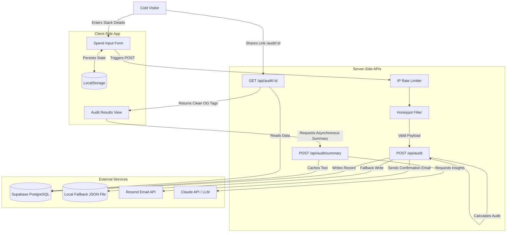

# System Architecture

This document describes the architectural layout, stack choices, data flows, and scaling plans for the **AI Spend Audit** application.

---

## 1. System Topology (Mermaid Diagram)

---

## 2. Core Data Flow

1. **Input Phase:**
   - The user checks active AI tools, inputs plans, seat sizes, and monthly spends in the `SpendForm` component. 
   - These parameters, along with `teamSize` and `primaryUseCase`, are stored in browser `LocalStorage` so state is preserved across page refreshes.

2. **Submission Phase:**
   - The client packages inputs and sends a payload to `POST /api/audit`.
   - The server validates the request:
     - Checks the client's IP against an in-memory rate-limiter (max 5 requests per minute) to prevent bot flooding.
     - Inspects the hidden `website` honeypot field. If populated, it rejects the submission as spam.
     - Passes the data to the deterministic `runSpendAudit()` engine.

3. **Analysis & Storage Phase:**
   - The engine recalculates costs, evaluates plan optimizations, checks tool seat minimums, flags duplication, and estimates potential monthly and annual savings.
   - The server inserts the audit inputs and results into the database. If Supabase keys are missing, it defaults to a local `db_fallback.json` file.
   - If an email is provided, the server triggers an asynchronous call to the Resend API to dispatch a confirmation email with a link to the report.
   - The server returns the generated `auditId` and the calculated summary.

4. **Background Synthesis:**
   - The client loads the results page immediately, showing the calculations, tables, and charts.
   - In the background, the client hits `POST /api/audit/summary` to fetch a personalized text summary.
   - The API queries the LLM (Anthropic Claude 3.5 Sonnet / OpenAI GPT-4o-mini), saves the response text back to the database record, and returns it to the client.

5. **Viral Loop / Public View:**
   - When a user copies the share link (`/audit/[id]`), another developer visiting that page loads a server-rendered layout.
   - The server fetches the audit record by ID, filters out identifying variables (`email`, `company_name`, `role`), and populates the page metadata (dynamic Open Graph title and descriptions) before rendering.

---

## 3. Technology Stack Justification

- **Next.js 15 (App Router):** Chosen because it bridges frontend and backend dynamically. Next.js supports server-side rendering (SSR), which is mandatory for rendering dynamic Open Graph cards, while hosting API routes within the same deployment footprint.
- **TypeScript:** Enforces strict parameter models, ensuring that pricing parameters, tool configurations, and database schema mappings remain consistent during edits.
- **Tailwind CSS:** Provides an efficient styling utility to construct premium dark UI cards without bundles of custom CSS or design components that slow down page loads.
- **Local JSON Database Fallback:** Added as an architectural contingency. During developer testing or local run, the system operates seamlessly without requiring database setups, while production environments easily bind to a PostgreSQL Supabase database.
- **Node.js Native Test Runner:** Avoids compiler complications, package mismatches, or configurations of Jest, ensuring fast validation.

---

## 4. Scaling Plan (Handling 10k Audits/Day)

If this application scales to handle 10,000+ audits per day, the current architecture would require the following changes:

1. **Redis Cache for Rate Limiting & Session Store:**
   - Next.js serverless functions are stateless; in-memory rate limiting Map will reset across deployments and won't sync across serverless instances. 
   - Deploying an Upstash Redis database to track IP request rates guarantees consistent rate-limiting across edge regions.

2. **Asynchronous Message Queue for AI Summary and Emails:**
   - Standard HTTP requests to the Anthropic API (taking 2-4 seconds) and Resend API can exceed Serverless function timeouts and block connection pools.
   - We would transition the API to immediately save the audit inputs, return the audit ID, and push a job to an asynchronous queue (e.g., BullMQ or AWS SQS). A worker process would consume the queue, query the LLM, update the database, and send the email.

3. **Read Replicas & Database Connection Pooling:**
   - 10k audits/day will trigger heavy read traffic for shared public links. We would deploy a Connection Pooler (like PgBouncer or Supabase Supavisor) to prevent PostgreSQL connection depletion, and cache public audit reads in a Redis key-value store with an expiration of 24 hours.

4. **Edge CDN Caching for Public Audit Routes:**
   - Configure cache control headers (`Cache-Control: public, s-maxage=3600`) on `/audit/[id]` routes so that static CDN edge cache servers serve the page directly to repeat visitors without hitting the backend database.
